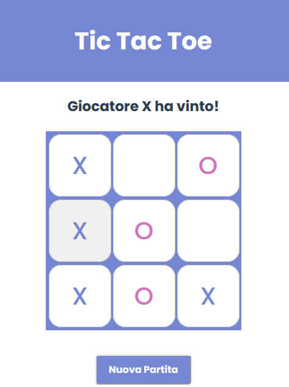

# <h1>Tic Tac Toe</h1>

"Tic Tac Toe", conosciuto anche come "Tris" in Italia, è un gioco da tavolo per due giocatori. Si gioca su una griglia 3x3 dove i giocatori, a turno, collocano il proprio simbolo (solitamente "X" per il primo giocatore e "O" per il secondo) in una casella vuota. Lo scopo del gioco è allineare tre dei propri simboli in orizzontale, verticale o diagonale.  
Puoi accedere all'app <a href="https://tictactoe-francescofiorentino.netlify.app">qui</a>.

## Il gioco

(<a href="#readme-top">Torna su</a>)
 

## Tecnologie utilizzate
- HTML
- CSS
- JavaScript
- Vue
- Intelligenza Artificiale (ChatGPT, Codeium) per debug

(<a href="#readme-top">Torna su</a>)
 

## Contatti

Francesco Fiorentino - [LinkedIn](https://www.linkedin.com/in/francesco-fiorentino-8a854216a/)

(<a href="#readme-top">Torna su</a>)
 